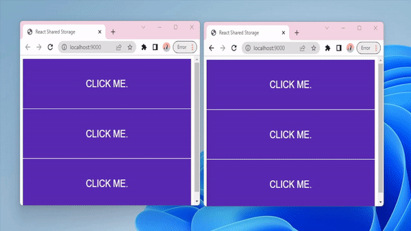

# React Shared Storage


React Shared Storage is built to be a simple way for storing state in the browsers local storage. It will keep your state synced between different components and different windows and tabs.



## Installation

Install it with Yarn:

```shell
yarn add react-shared-storage
```

Or NPM:

```shell
npm i react-shared-storage
```

## Usage

The package exposes the `usePersistentState` hook which works similarly to set state. The biggest difference is that you will
also have to provide a key property which is used to identify the property between components and windows.

```tsx
import { usePersistentState } from 'react-shared-storage'

export function CounterComponent() {
  // The `counter` key will be used to identify the value.
  const [ counter, setCounter ] = usePersistentState('counter', 0)

  return (
    <div>
      <div>
        { counter }
      </div>
      <button onClick={ () => setCounter(counter + 1) }>
        Increase
      </button>
    </div>
  )
}

export function AnotherComponent() {
  // This component will also react to the `counter` value being changed.
  const [ counter, setCounter ] = usePersistentState('counter', 0)

  return (
    <div>
      <div>
        { counter }
      </div>
      <button onClick={ () => setCounter(counter + 1) }>
        Increase
      </button>
    </div>
  )
}

```

If you are want to save the state to local storage, but don't want it to sync between components and windows, you can disable the sync:

```tsx
usePersistentState('counter', 0, {
  shouldSync: false
})

```

The different options you can pass to the `usePersistentState` hook are:

|Name|Default Value|Description|
|---|---|---|
|**saveInterval**|`200`|Determines how often the state is synced between windows.|
|**shouldSync**|`true`|Used to enable or disable syncing of state between windows.|


## Development

There is a demo app in the `demo/` directory that you can use for testing.
Start it with:

```shell
yarn demo
```

There is a linter:

```shell
yarn lint
```

and a test suite:

```shell
yarn test
```

## Contributing

1. Fork it (<https://github.com/your-github-user/test/fork>)
2. Create your feature branch (`git checkout -b my-new-feature`)
3. Commit your changes (`git commit -am 'Add some feature'`)
4. Push to the branch (`git push origin my-new-feature`)
5. Create a new Pull Request

## Contributors

- [Christoffer Artmann](https://github.com/your-github-user) - creator and maintainer
